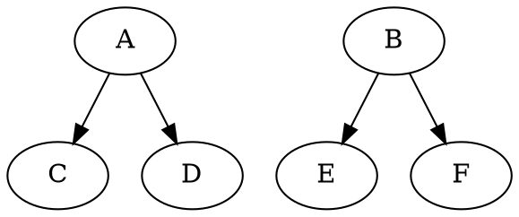

% Howlite
% Ian Shehadeh
% April 29, 2024


## Syntax

- C-like with a dash of Typescript and Rust
- stick to popular conventions
- Abbreviations: "bool", "int", etc.
- Symbols: "+", "-", "<", ">", etc.


-----

```
func fib(): u16 {
    let N: u16 = 10;
    let mut memory: [u16; 2] = [ 0, 1 ];
    let mut acc: u16 = 0;

    let i: u16 = 0;
    while i < N {
        acc = (memory.[0] + memory.[1]);
        memory.[0] = memory.[1];
        memory.[1] = acc;
        i = (i + 1);
    };

    acc
}
```

---

## Semantics

- Imperative
- Eager
- Typing: Static
- Scopes: Lexical

---

# Expressions

--- 

```
if 1 + 2 == 3 {
  ...
} else {
  panic("???")
}
```

---


```
let a: bool = {
  let a: 0..0 = 0;
  1 == a
};
```

---

```
for let i: uint in 0..10 {
    arr.[i]
}

for a < b {
  arr.[i]
}
```

---

```
switch value {
  case 1: ... // implicit break
  case 2: ... // implicit break
  // etc...
  Default: ...
}
```

---


```
type TaskFunction[P: any] = func(param: &rw P): unit;
type CStr = &[0..127];
type TaskHandle = uint;
extern func
xTaskCreate[P: any]( pvTaskCode: TaskFunction[P],
                     pcName: Cstr,
                     uxStackDepth: uint32,
			         pvParameters: &mut P, 
			         uxPriority: uint, 
			         taskHandle: &mut TaskHandle );
```

---


---

# Types

--- 

```
let i: 0..255 = 127;
```

---

```
let nothing: null = null;
```

---

```
let b: bool = true
```

---

```
let f: float64 = 1.333e4;
```

---

```
let b_ref: &bool = &b;
```

---

```
let array: [bool; 4] = [true, false, true, false];
```

---

```
let slice: &[bool] = &array.[1..3];
```

---

```
let h: char = 'h';
```

---

```
let greet: &string = "hello ";
```


---

```
type A[T: boxed] = {
  a: T,
  @align(4) { b1: 0..5, b2: 5..10 },
   c: u16
};
```


---

```
let a: A[1..2] = struct { a: 2, b1: 0, b2: 5, c:  0 }
```

---

```
type U = bool | null;
let a: U = true;
if a == true { }      /* type error */
```

----

```
type V = { a: 1..1, b: null } 
       | { a: 2..2, b: bool };

let v : V = struct { a: 1, b: null };
if v.a == 1 {
  /* v : { a: 1..1, b: null } */
}
```

---

# Compiler

---

